# Unified Parts Intelligence Platform (UPIP)

## Solution Presentation Page

---

## 1. The Cost of Inaction

### The Hidden Price of Post-Acquisition Chaos

**In January 2024, a mid-sized industrial manufacturer discovered that 18 months after acquiring a life sciences automation company, they were still paying $2.3M annually in duplicate inventory carrying costs.**

The acquisition was supposed to create synergies. Instead, it created confusion.

### The Numbers Tell the Story

| Impact Area | Annual Cost |
|-------------|-------------|
| Duplicate SKUs in inventory | $1.8M - $3.2M |
| Maverick spend (off-contract purchasing) | $500K - $1.2M |
| Compliance audit delays | $200K - $400K |
| Engineering time searching for parts | 2,400+ hours/year |

**The root cause?** Two disconnected PLM systems (Windchill and SolidWorks PDM) with no common part identifiers, no visibility into functional equivalents, and no way to know if a "new" part already exists under a different name in the legacy catalog.

> "We bought them for their biotech expertise. We inherited 15,000 duplicate part numbers." — VP of Operations, Industrial Manufacturing Company


---

## 2. The Problem in Context

### Five Pain Points Crippling Post-Acquisition Integration

#### 1. Part Proliferation: The Invisible Cost Multiplier

**Business Impact:** Every duplicate SKU costs $150-$300 annually in carrying costs, procurement overhead, and warehouse space.

Engineers in the Industrial division search Windchill. Engineers from the acquired BioFlux team search SolidWorks PDM. Neither knows what the other has. A "new" high-precision valve gets created when three identical valves already exist in the legacy catalog.

#### 2. Split Procurement Volume: Losing Leverage

**Business Impact:** Fragmented purchasing across 2x the supplier base eliminates volume discounts worth 10-20% of spend.

The same stainless steel fasteners are purchased from four different suppliers—two inherited from each company—at prices ranging from $0.42 to $0.89 per unit. No one knows they're buying the same part.

#### 3. Compliance Blind Spots: Regulatory Roulette

**Business Impact:** FDA 483 observations cost $50K-$500K+ in remediation and can delay product launches by 6-12 months.

BioFlux's life sciences products require 21 CFR Part 11 compliance and ISO 13485 traceability. When an engineer grabs a "similar-looking" part from the Industrial catalog, there's no automatic check for regulatory status. Compliance violations surface months later during audits.

#### 4. Supplier Risk Concentration: Hidden Vulnerabilities

**Business Impact:** Single-source dependencies create 3-6 week supply disruptions when issues arise.

Post-merger, procurement discovers that 40% of critical components now flow through three suppliers—none of whom were flagged as high-risk because the data lived in separate systems.

#### 5. Engineering Productivity Drain: Death by Search

**Business Impact:** Engineers spend 15-20% of their time searching for existing parts instead of designing new products.

"Can I find an existing motor that fits these specs?" becomes a multi-hour odyssey through email threads, shared drives, and shouting across cubicles. The answer is usually "just design a new one"—even when perfect alternatives exist.

---

## 3. The Transformation

### From Fragmented Chaos to Unified Intelligence

| Before: The Old Way | After: UPIP |
|---------------------|-------------|
| **Search 5 systems** to find if a part exists | **One AI-powered search** finds functional equivalents in seconds |
| **Manual spreadsheet matching** misses semantic equivalents ("Hex Screw" ≠ "Screw, Hexagonal") | **Vector embeddings** understand meaning, not just text |
| **Compliance status unknown** until audit finds violations | **FDA/ISO badges** appear automatically on matching parts |
| **Supplier risk invisible** across business units | **Risk heatmaps** expose concentration and financial stability |
| **Consolidation savings theoretical** | **Quantified scenarios** with projected ROI and implementation costs |

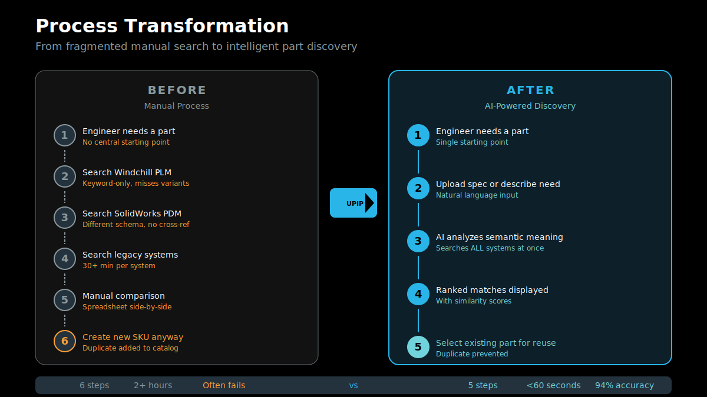

### The "Wow" Moment

> An engineer uploads a spec sheet for a "new" high-precision valve. The system analyzes the geometry and specs using AI, instantly retrieving three identical valves already available in the legacy Snowcore inventory—**flagging one that is already FDA-compliant**—preventing the creation of a duplicate SKU.

**Time to answer: < 2 seconds**
**Traditional approach: 2-4 hours (if they find it at all)**


---

## 4. What We'll Achieve

### Measurable Outcomes Tied to Business KPIs

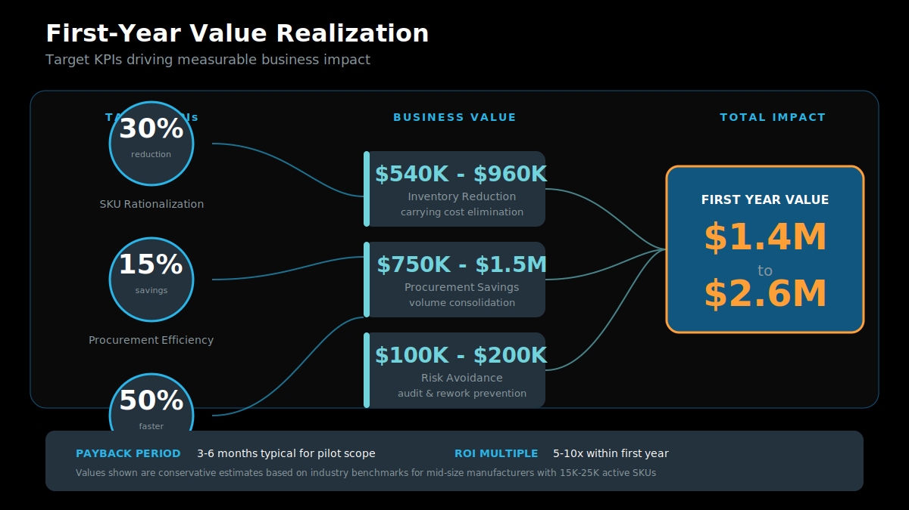

| KPI | Target | Business Value |
|-----|--------|----------------|
| **SKU Rationalization** | 30% reduction in active parts | $540K - $960K annual inventory savings |
| **Procurement Efficiency** | 15% cost savings via consolidation | $750K - $1.5M annual procurement savings |
| **Compliance Velocity** | 50% faster audit turnaround | $100K - $200K avoided remediation costs |
| **Engineering Productivity** | 80% reduction in part search time | 1,900+ engineering hours returned to design |

### ROI Timeline

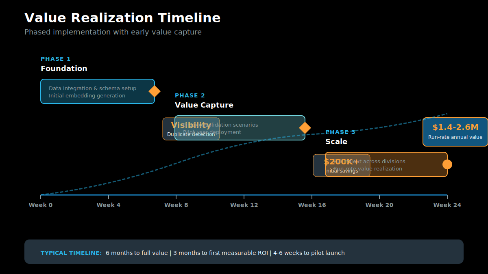

| Phase | Milestone | Value Captured |
|-------|-----------|----------------|
| Month 1-2 | Duplicate identification complete | Visibility into $2M+ at-risk inventory |
| Month 3-4 | First consolidation scenarios executed | $200K-$400K realized savings |
| Month 6 | Full platform adoption across BUs | Run-rate savings of $1.2M+ annually |
| Month 12 | Continuous improvement cycle established | 15%+ year-over-year efficiency gains |

### Value by Persona

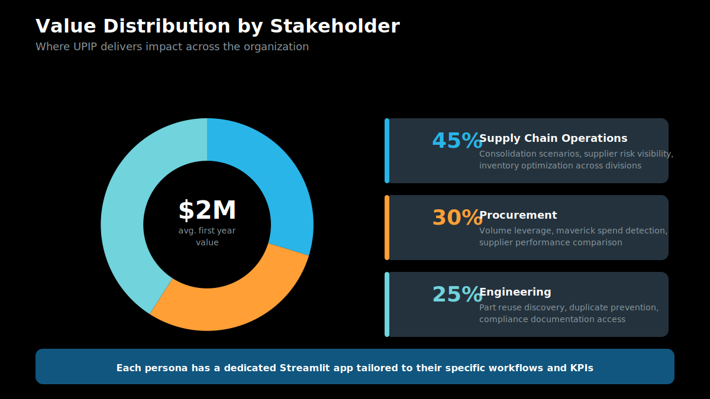

---

## 5. Why Snowflake

### Four Pillars of the Snowflake Advantage

#### Unified Data Platform

**No more data silos.** Windchill exports, SolidWorks PDM data, supplier scorecards, and compliance documents all live in one governed location. Engineers query one system, not five.

- Single source of truth across business units
- Real-time data freshness (no overnight ETL delays)
- Governed access controls by role and department

#### Native AI/ML with Cortex

**Intelligence built in, not bolted on.** Snowflake Cortex provides the AI foundation:

- **EMBED_TEXT_768**: Generate semantic embeddings without moving data
- **Cortex Search**: RAG over engineering documents and compliance records
- **Cortex Analyst**: Natural language queries against structured KPIs
- **Cortex Agent**: Orchestrated multi-tool assistant for complex questions

#### Snowpark ML for Custom Models

**Train where the data lives.** The part similarity model runs entirely within Snowflake:

- No data egress to external ML platforms
- GPU-accelerated training and inference
- Version-controlled model artifacts alongside the data

#### Enterprise Governance

**Security and compliance by design:**

- Role-based access controls (RBAC) for sensitive supplier and pricing data
- Data lineage tracking from source PLM to analytical outputs
- Audit logging for regulatory compliance (21 CFR Part 11)

---

## 6. How It Comes Together

### Solution Architecture


### Step-by-Step Solution Walkthrough

#### Step 1: Data Ingestion

Raw PLM exports from Windchill and SolidWorks PDM land in the `RAW` schema. Stored procedures normalize disparate formats into a unified structure.

```
Windchill Export → RAW.PLM_EXPORTS
SolidWorks PDM  → RAW.PLM_EXPORTS
Compliance Docs → RAW.ENGINEERING_DOCS
```

#### Step 2: Data Harmonization

The `ATOMIC` schema creates a single part master with global identifiers, supplier linkages, and compliance status flags.

```
RAW.PLM_EXPORTS → ATOMIC.PART_MASTER
                → ATOMIC.SUPPLIER_MASTER
                → ATOMIC.PURCHASE_ORDERS
```

#### Step 3: ML-Powered Similarity

A Snowflake Notebook generates 768-dimensional embeddings for each part using Cortex's E5-base-v2 model. Cosine similarity identifies functional equivalents.

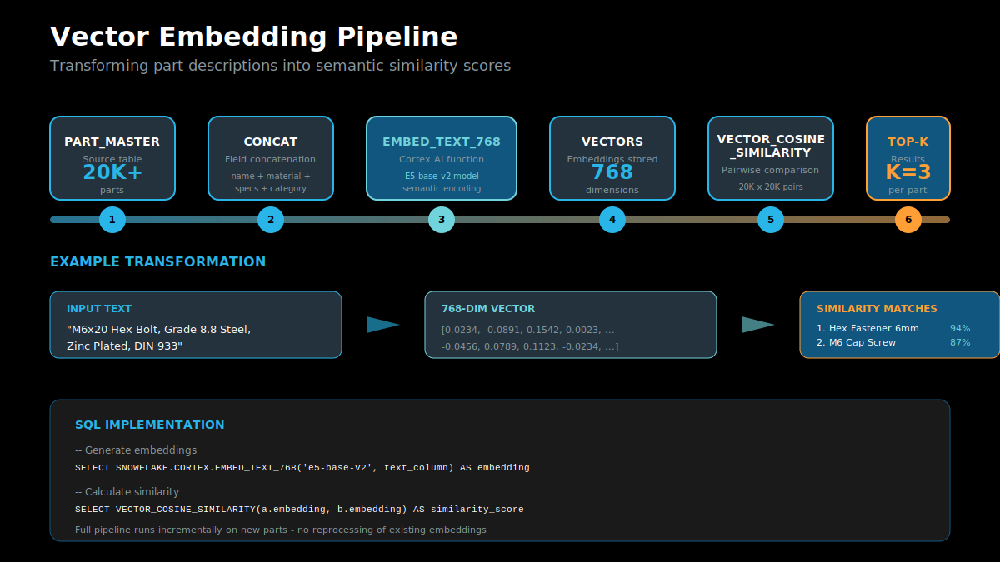

#### Step 4: Analytics Layer

Enriched views combine part data, supplier risk scores, and consolidation scenarios for persona-specific dashboards.


#### Step 5: Cortex Intelligence Services

Three Cortex services power the AI-assisted experience:

| Service | Purpose |
|---------|---------|
| **Cortex Search** | RAG over engineering docs and compliance records |
| **Cortex Analyst** | Natural language to SQL for KPI queries |
| **Cortex Agent** | "Sourcing Assistant" orchestrating all tools |

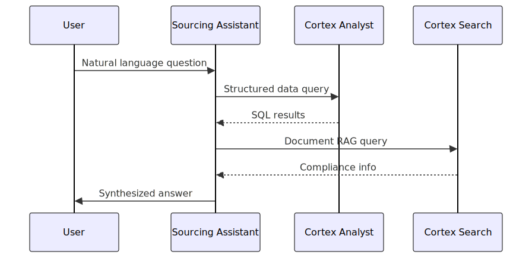

#### Step 6: Streamlit Application

Three persona-optimized pages deliver role-specific value:

| Page | Persona | Key Actions |
|------|---------|-------------|
| **Part Matcher** | R&D Engineer | Upload spec, find equivalents, track reuse |
| **Supply Chain Tower** | VP Supply Chain | Review consolidation ROI, assess risk |
| **Procurement Ops** | Procurement Manager | Detect maverick spend, compare suppliers |

---

## Appendix: Detailed Views

### Detailed Architecture


### Data Model


---

## Next Steps

1. **Technical Deep-Dive**: See `UPIP_Architecture.md` for detailed system design
2. **Live Demo**: Access the Streamlit application in Snowflake
3. **About Page**: In-app documentation at `streamlit/pages/4_About.py`
4. **Blog Post**: External-facing narrative at `UPIP_Blog.md`
5. **Executive Deck**: Slide content at `UPIP_Slides.md`
